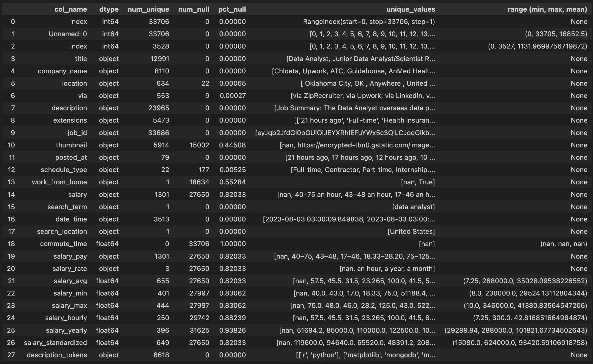

<div align="center">

<<<<<<< HEAD
# **Decoding Data Jobs**
##### *Analyzing job postings to find desired skill sets for aspiring data nerds.*

</div>
=======
# **Decoding the Data Job Market: An Analysis of Data Job Postings**
</p>
>>>>>>> 4beeb59e4937579ecf71ef59737fa9151248c478

---
 
Zacharia Schmitz<br>
Joshua Click<br>
<<<<<<< HEAD
October - November 2023<br>
=======
24 October 2023<br>
>>>>>>> 4beeb59e4937579ecf71ef59737fa9151248c478

<div align="center">


*Picture of dashboard deliverable when completed*

</div>

--- 

#### **Table of Contents:**

###### *(Jump To)*

[Project Overview](#overview)

[Data Acquisition](#acquire)

[Preparation](#preparing-data)

[Exploration](#exploration-questions)

[Models](#modeling)

[Conclusion](#conclusions)

</p>

---

<<<<<<< HEAD
## **Overview**

1. Decide Source

2. Acquire Job Postings
=======
<br>

## Overview


##### We downloaded the data from Kaggle as a .csv

1. Decide how to clean / prep the data.

2. Text Preprocessing
>>>>>>> 4beeb59e4937579ecf71ef59737fa9151248c478

2. Explore Separately to see the data from different angles.

3. Feature Extraction

4. Model Training

<<<<<<< HEAD
6. Model Training

7. Dashboard (Presenting Model-Validated Findings)

=======
5. Reusable Functioinality in the Form of a Dashboard
>>>>>>> 4beeb59e4937579ecf71ef59737fa9151248c478

---

## **Project Goal**

<<<<<<< HEAD
**Goal Text Here**
=======
Our main goal of the project is to deliver a dashboard to show skill sets that are in demand. We will be using machine learning models to validate that the analysis conducted is sound and accurate.

## Plan → Acquire → Prepare → Explore → Model → Deliver
>>>>>>> 4beeb59e4937579ecf71ef59737fa9151248c478

--- 

## **Project Description**

<<<<<<< HEAD
**Description Here**

---


<br>

## **Initial Questions and Hypotheses**

1. Question 1

    - Answer 1

2. 2

    - 2

3. 3

    - 3

4. 4

    - 4

5. 5

    - 5
=======
- NLP: To find commonalities in posts.

- Classification: To predict the location, job type, etc. based on other features

- Regression: To predict pay based on location/skills

- Dashboard: Possibly include drop down boxes for skill/locations/job titles to demonstrate full stack data science capabilities
>>>>>>> 4beeb59e4937579ecf71ef59737fa9151248c478

<br>


---


<br>

## **Acquire**

<<<<<<< HEAD
#### *Rate Limits & Ethics*

[**Google's Robots.txt**](google.com/robots.txt)

```
User-agent: *
Disallow: /search

```
=======
1. What skills are most common between job postings?

2. Which skills pay the most?

3. What are the most common locations for work?

4. 

<br>

---


<br>

## Acquire

Data originated from Google Jobs “Data Analyst” postings. While we built a web scraper to pull the data ourselves, this Kaggle Dataset already has a year's worth of data and is adding 100~ daily by automation.

Link: https://www.kaggle.com/datasets/lukebarousse/data-analyst-job-postings-google-search/data?select=gsearch_jobs.csv
>>>>>>> 4beeb59e4937579ecf71ef59737fa9151248c478

Google's Terms of Service explicitly disallow scraping of its services without permission. Scraping can lead to legal consequences. Although Google does not take legal action against scraping, it uses a range of defensive methods that makes scraping their results a challenging task, even when the scraping tool is realistically spoofing a normal web browser.

<<<<<<< HEAD
Offending IPs and offending IP networks can easily be stored in a blacklist database to detect offenders much faster. Using a proxy or VPN is necessary for anything outside of human-like.

We managed to very slowly scrape several hundred job postings using Selenium, but in order to perform accurate large scale analysis, we'd need much more time, or a much larger dataset.

#### *Kaggle Dataset*

While it was undesirable to use a public dataset for analysis, I was able to find a Kaggle dataset that has been updating daily for the past year. The dataset is currently around 150MB and 33,000 different job postings from around the United States.


<br> <br>

=======
- 

- 

- 

- 

- 


<br>
>>>>>>> 4beeb59e4937579ecf71ef59737fa9151248c478
<br>

---


<br>

### **Data Dictionary:**

<div align="center">



### Definitions

| Column | Definition |
|--------|-----------|
|`Unnamed: 0`|DROPPED - Extra column created when owner exported CSV|
|`index`|DROPPED - Extra column created when owner exported CSV|
|`title`|The job title from the job posting|
|`company_name`|The company name from the job posting|
|`location`|The location of the job from the posting|
|`via`|The original posting location|
|`description`|The job description from Google Jobs search|
|`extensions`|Tags generated by Google, age of post, pay range, benefits, etc - will be parsed through|
|`job_id`|Looks to be a unique ID for the job posting - will try to reverse engineer to be useful|
|`thumbnail`|DROPPED - The thumbnail of the company from the Google Jobs posting|
|`posted_at`|How long ago the job was posted, from time of scraping|
|`schedule_type`|The working schedule of job - Ex: Full-time, part-time, etc.|
|`work_from_home`|If the job is work from home aka remote|
|`salary`|The pay for the postion - non-standardized (hourly, annual range, etc.)|
|`search_term`|DROPPED - The original search term to find the job posting on Google Jobs|
|`date_time`|The date/time that the job posting was pulled|
|`search_location`|DROPPED - The country the search was filtered for (United States)|
|`commute_time`|DROPPED - The commute time field from Google Jobs - Null only|
|`salary_pay`|The pay for the postion - non-standardized (hourly, annual range, etc.)|
|`salary_rate`|The rate of labeled pay - *hourly, weekly, monthly, annually*|
|`salary_avg`|If provided a range, the average between the min and max|
|`salary_min`|Lower end of the salary range, if available|
|`salary_max`|Higher end of the salary range, if available|
|`salary_hourly`|Hourly pay, if available|
|`salary_yearly`|Annual salary, if available|
|`salary_standardized`|Calculated annual salary, if any rate of pay is provided|
|`description_tokens`|Tokenized skills pulled from description column|

</div>

</p>

<br>
<br>


---

## **Preparing Data**

<<<<<<< HEAD
*prep steps here*

=======
* 

* 

* 

* 

* 

* 

* 

* 

* 

* 

* 

* 
>>>>>>> 4beeb59e4937579ecf71ef59737fa9151248c478
---
<br>

## **Exploration Questions**

1. 

2. 

3. 

4. 
<<<<<<< HEAD

5. 
=======
>>>>>>> 4beeb59e4937579ecf71ef59737fa9151248c478

<br>
<br>


---


<br>

## **Modeling**

Utilize GridSearch for best parameters for TF-IDF and LogisticRegression

```python
# Grid Search Function

```
---

### Best GridSearch:

```python
# Best Hyperparameters

```

**Baseline:**

**Best cross-validation score:**

**Train Set:**

**Test Set:**

<br>
<br>


---


<br>

## **How to Reproduce:**

1. Clone this repo (required CSV is in support_files)

2. Run the notebook.

<br>
<br>


---

<br>

## **Conclusions**

### Recommendations

##### - For Modeling:


##### - For Data Collection:

